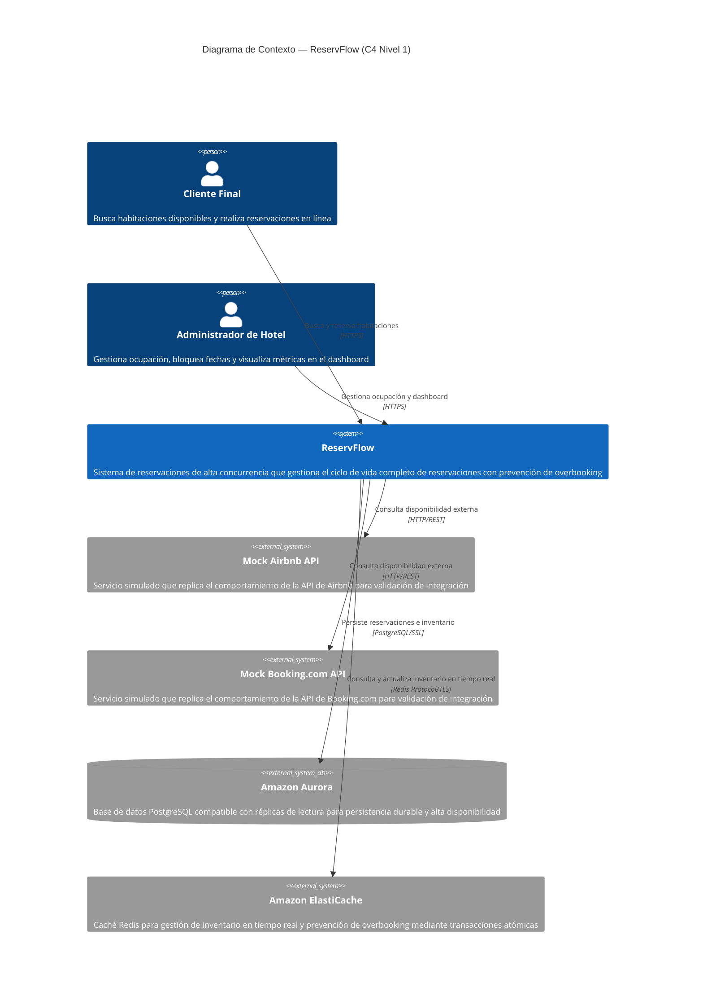
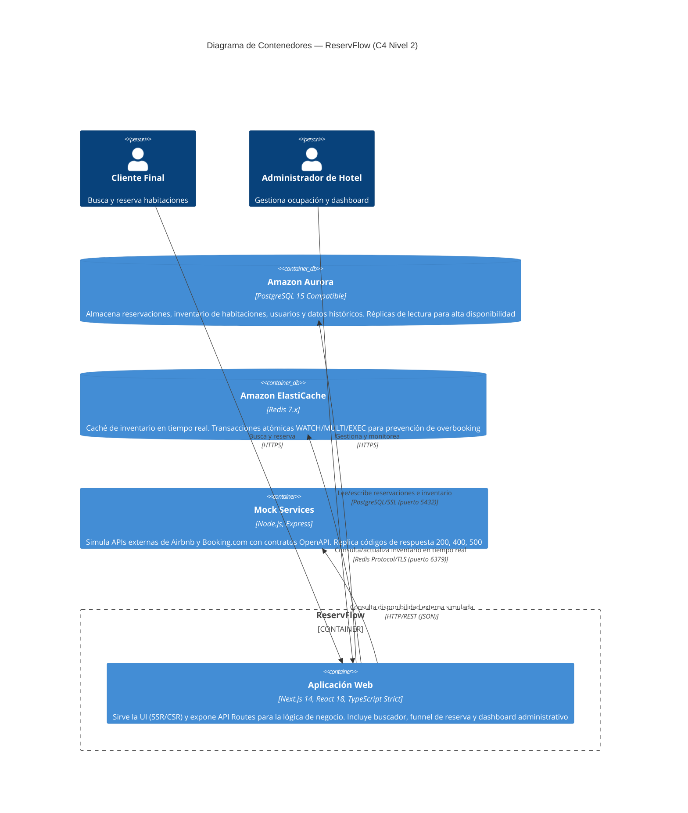
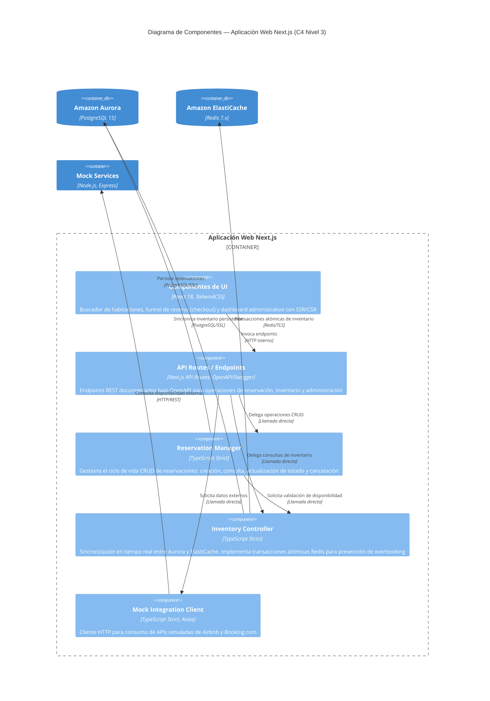

# Diagramas del Modelo C4 — ReservFlow (ApexReservations)

**Autores:** Emilio Daniel Guzmán Seda y León Carlo Rivera Cárdenas  
**Stakeholder:** Mtra. Sarahí Ochoa Partida  
**Fecha de elaboración:** Junio 2025

---

## Introducción

El **Modelo C4** es un método de visualización arquitectónica de software creado por Simon Brown que proporciona un enfoque jerárquico para describir la arquitectura de un sistema en cuatro niveles de abstracción: **Contexto**, **Contenedores**, **Componentes** y **Código**. Cada nivel ofrece una perspectiva diferente del sistema, permitiendo que distintos públicos (stakeholders, arquitectos, desarrolladores) comprendan la estructura del software de manera progresiva.

En el contexto del proyecto **ReservFlow** (ApexReservations), el Modelo C4 se aplica para documentar la arquitectura de un sistema de reservaciones de alta concurrencia construido con Next.js 14, TypeScript estricto, Amazon Aurora (PostgreSQL) y Amazon ElastiCache (Redis). Los diagramas cubren tres niveles:

- **Nivel 1 — Contexto:** Muestra a ReservFlow como sistema central y sus interacciones con actores externos (Cliente Final, Administrador de Hotel), sistemas externos simulados (Mock Airbnb API, Mock Booking.com API) y servicios de infraestructura AWS (Amazon Aurora, Amazon ElastiCache).
- **Nivel 2 — Contenedores:** Descompone ReservFlow en sus contenedores tecnológicos, detallando las tecnologías específicas y los protocolos de comunicación entre ellos.
- **Nivel 3 — Componentes:** Detalla los componentes internos del contenedor principal (Aplicación Web Next.js), mostrando la separación de responsabilidades y los flujos de datos entre módulos.

Todos los diagramas utilizan la notación **Mermaid** para su renderizado directo en Markdown y mantienen trazabilidad con los requerimientos funcionales (FR-01 a FR-07) y no funcionales (NFR-01 a NFR-08) definidos en los Puntos 1 y 2 del proyecto.

---

## Tabla de Contenidos

1. [Diagrama de Contexto (C4 Nivel 1)](#1-diagrama-de-contexto-c4-nivel-1)
2. [Diagrama de Contenedores (C4 Nivel 2)](#2-diagrama-de-contenedores-c4-nivel-2)
3. [Diagrama de Componentes (C4 Nivel 3)](#3-diagrama-de-componentes-c4-nivel-3)

---

## 1. Diagrama de Contexto (C4 Nivel 1)

Este diagrama muestra a ReservFlow como sistema central y sus interacciones con actores externos y sistemas de infraestructura. Representa las fronteras del sistema, identificando claramente qué elementos son internos al sistema y cuáles son externos. Los actores humanos (Cliente Final y Administrador de Hotel) interactúan con ReservFlow a través de HTTPS, mientras que el sistema se comunica con servicios externos simulados (Mock APIs) mediante HTTP/REST y con la infraestructura AWS (Aurora y ElastiCache) mediante protocolos seguros.

### Diagrama

### Tabla de Elementos

| Elemento | Tipo | Responsabilidad |
|----------|------|-----------------|
| Cliente Final | Persona | Busca habitaciones disponibles por fechas y capacidad, y realiza reservaciones en línea |
| Administrador de Hotel | Persona | Gestiona la ocupación del hotel, bloquea fechas y visualiza métricas en el dashboard administrativo |
| ReservFlow | Sistema | Sistema central de reservaciones de alta concurrencia con prevención de overbooking. Gestiona el ciclo de vida completo de reservaciones (CRUD) |
| Mock Airbnb API | Sistema Externo | Servicio simulado que replica el comportamiento de la API de Airbnb para validación de integración con plataformas externas |
| Mock Booking.com API | Sistema Externo | Servicio simulado que replica el comportamiento de la API de Booking.com para validación de integración con plataformas externas |
| Amazon Aurora | Base de Datos Externa | Persistencia durable de reservaciones, inventario, usuarios y datos históricos. PostgreSQL 15 compatible con réplicas de lectura para alta disponibilidad |
| Amazon ElastiCache | Sistema Externo | Caché Redis para gestión de inventario en tiempo real. Implementa transacciones atómicas (WATCH/MULTI/EXEC) para prevención de overbooking |

### Descripción Narrativa

El diagrama de contexto establece las fronteras del sistema ReservFlow. Dentro de la frontera del sistema se encuentra la aplicación central que gestiona reservaciones de hotel con prevención de overbooking. Fuera de la frontera se identifican:

- **Actores humanos:** El Cliente Final interactúa con el sistema para buscar y reservar habitaciones, mientras que el Administrador de Hotel gestiona la ocupación y monitorea métricas a través del dashboard.
- **Sistemas externos simulados:** Las Mock APIs de Airbnb y Booking.com permiten validar la integración con plataformas externas de reservaciones sin depender de servicios reales en fase de desarrollo.
- **Infraestructura AWS:** Amazon Aurora proporciona persistencia durable con alta disponibilidad (réplicas de lectura, failover automático), y Amazon ElastiCache (Redis) actúa como fuente de verdad para el inventario en tiempo real, garantizando la prevención de overbooking mediante transacciones atómicas.

Todas las comunicaciones entre actores y el sistema se realizan sobre HTTPS. Las integraciones con Mock Services utilizan HTTP/REST con contratos OpenAPI definidos. La comunicación con Aurora se realiza mediante PostgreSQL/SSL y con ElastiCache mediante Redis Protocol/TLS.

---

## 2. Diagrama de Contenedores (C4 Nivel 2)

Este diagrama descompone ReservFlow en sus contenedores tecnológicos, mostrando las tecnologías específicas de cada uno y los protocolos de comunicación entre ellos. Un contenedor representa una unidad de ejecución o almacenamiento de datos que se despliega de forma independiente. ReservFlow se compone de cuatro contenedores principales: la Aplicación Web (Next.js 14), Amazon Aurora (PostgreSQL 15), Amazon ElastiCache (Redis 7.x) y los Mock Services (Node.js/Express).

### Diagrama

### Tabla de Protocolos de Comunicación

| Origen | Destino | Protocolo | Propósito |
|--------|---------|-----------|-----------|
| Cliente Final / Administrador de Hotel | Aplicación Web (Next.js 14) | HTTPS | Interacción con la interfaz de usuario y consumo de API Routes |
| Aplicación Web | Amazon Aurora (PostgreSQL 15) | PostgreSQL/SSL (puerto 5432) | Persistencia durable de reservaciones, inventario, usuarios y datos históricos |
| Aplicación Web | Amazon ElastiCache (Redis 7.x) | Redis Protocol/TLS (puerto 6379) | Consulta y actualización de inventario en tiempo real; transacciones atómicas para prevención de overbooking |
| Aplicación Web | Mock Services (Node.js/Express) | HTTP/REST (JSON) | Integración con APIs externas simuladas de Airbnb y Booking.com |

### Tecnologías por Contenedor

| Contenedor | Tecnología | Descripción |
|------------|------------|-------------|
| Aplicación Web | Next.js 14, React 18, TypeScript Strict | Monolito modular que sirve la UI mediante SSR/CSR y expone API Routes para la lógica de negocio. Incluye buscador de habitaciones, funnel de reserva y dashboard administrativo |
| Amazon Aurora | PostgreSQL 15 Compatible | Base de datos relacional administrada con réplicas de lectura para alta disponibilidad (>= 99.9%) y failover automático (< 30 segundos) |
| Amazon ElastiCache | Redis 7.x | Caché en memoria para inventario en tiempo real. Soporta transacciones atómicas WATCH/MULTI/EXEC para garantizar zero-overbooking bajo concurrencia |
| Mock Services | Node.js, Express | Servicios simulados con contratos OpenAPI que replican el comportamiento de las APIs de Airbnb y Booking.com, incluyendo códigos de respuesta 200, 400 y 500 |

---

## 3. Diagrama de Componentes (C4 Nivel 3)

Este diagrama detalla los componentes internos del contenedor principal de ReservFlow: la Aplicación Web Next.js. Muestra la separación de responsabilidades entre los módulos internos y los flujos de datos entre ellos. Los componentes incluyen la capa de presentación (Componentes de UI), la capa de API (API Routes/Endpoints), la lógica de negocio (Reservation Manager e Inventory Controller) y la integración externa (Mock Integration Client).

### Diagrama

### Tabla de Componentes

| Componente | Tecnología | Responsabilidad | Requerimientos |
|------------|------------|-----------------|----------------|
| Componentes de UI | React 18, TailwindCSS | Buscador de habitaciones con filtros por fechas y capacidad, funnel de reserva (checkout) con validación de datos, y dashboard administrativo con métricas de ocupación. Renderizado mediante SSR/CSR | FR-03, FR-05 |
| API Routes / Endpoints | Next.js API Routes, OpenAPI/Swagger | Endpoints REST documentados bajo la especificación OpenAPI para operaciones de reservación, consulta de inventario y administración del sistema | FR-04, NFR-05 |
| Reservation Manager | TypeScript Strict | Gestiona el ciclo de vida CRUD completo de reservaciones: creación de nuevas reservaciones, consulta por filtros, actualización de estado (confirmada, cancelada, completada) y cancelación con liberación de inventario | FR-01, FR-02 |
| Inventory Controller | TypeScript Strict | Sincronización en tiempo real entre Amazon Aurora y Amazon ElastiCache. Implementa transacciones atómicas Redis (WATCH/MULTI/EXEC) para prevención de overbooking. Gestiona el patrón Cache-Aside con invalidación activa | FR-04, NFR-01, NFR-02 |
| Mock Integration Client | TypeScript Strict, Axios | Cliente HTTP para consumo de APIs simuladas externas de Airbnb y Booking.com. Maneja contratos OpenAPI, timeouts y códigos de error (200, 400, 500) | FR-06 |

### Dependencias y Flujos de Datos

El flujo de datos dentro de la Aplicación Web sigue una arquitectura en capas:

1. **Componentes de UI → API Routes:** La capa de presentación invoca los endpoints REST mediante llamadas HTTP internas. Los componentes de UI no acceden directamente a la lógica de negocio ni a las bases de datos.

2. **API Routes → Reservation Manager:** Los endpoints de reservación delegan las operaciones CRUD al Reservation Manager mediante llamadas directas. El API Route actúa como controlador que valida la solicitud HTTP y delega la lógica de negocio.

3. **API Routes → Inventory Controller:** Los endpoints de consulta de disponibilidad delegan al Inventory Controller, que consulta ElastiCache (Redis) para obtener el inventario en tiempo real.

4. **Reservation Manager → Inventory Controller:** Antes de confirmar una reservación, el Reservation Manager solicita al Inventory Controller la validación de disponibilidad. El Inventory Controller ejecuta la transacción atómica en Redis (WATCH/MULTI/EXEC) para garantizar zero-overbooking.

5. **Reservation Manager → Aurora:** Las reservaciones confirmadas se persisten en Amazon Aurora (PostgreSQL) para durabilidad.

6. **Inventory Controller → ElastiCache:** Las operaciones de inventario en tiempo real (consulta, decremento, incremento) se ejecutan contra ElastiCache (Redis) con transacciones atómicas.

7. **Inventory Controller → Aurora:** El Inventory Controller sincroniza el estado del inventario entre Redis y Aurora siguiendo el patrón Cache-Aside con invalidación activa (ADR-004).

8. **API Routes → Mock Integration Client:** Los endpoints que requieren datos de plataformas externas delegan al Mock Integration Client, que consulta los Mock Services mediante HTTP/REST.

---

*Documento generado como parte del Punto 3: Diseño del Sistema con Criterios de Calidad del proyecto ReservFlow (ApexReservations) para la materia de Calidad de Software.*
